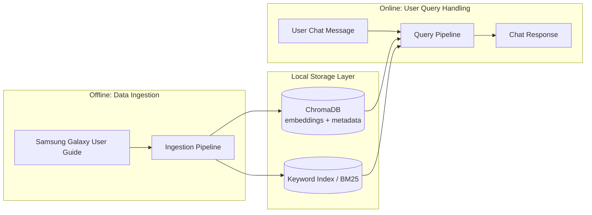
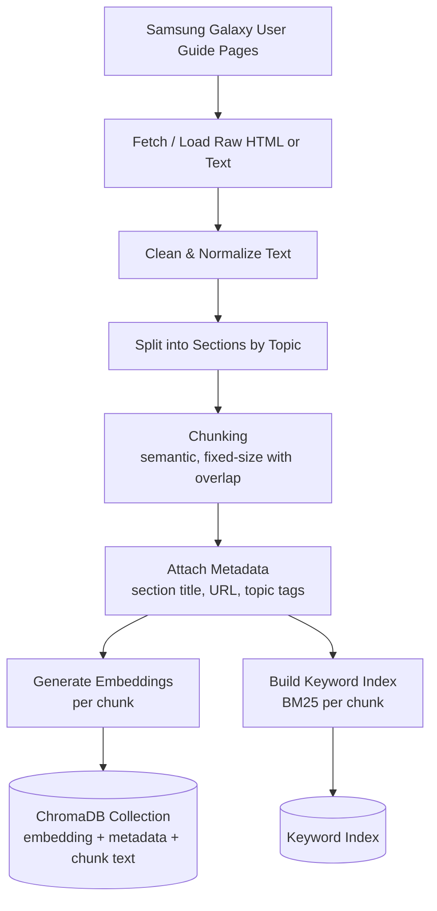
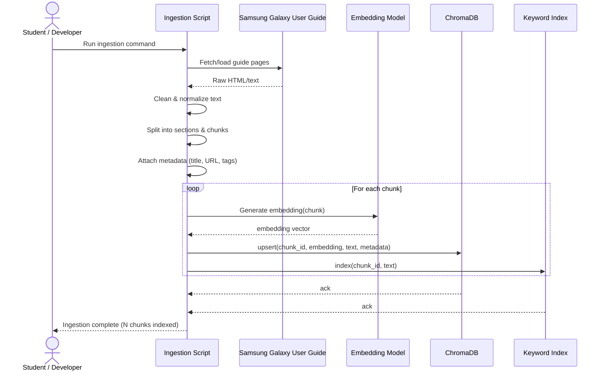
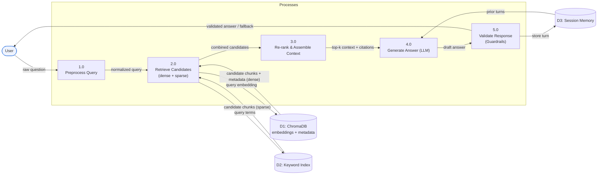
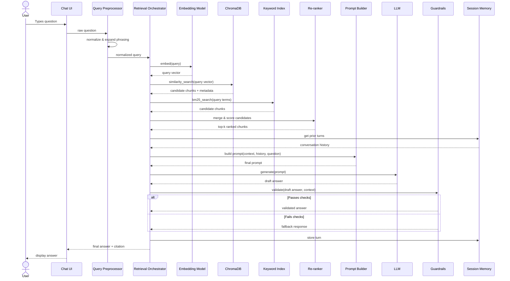
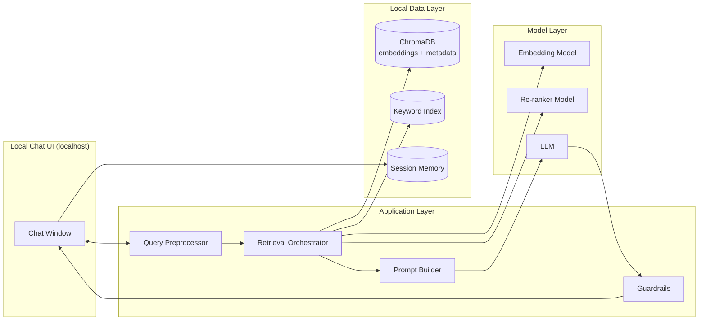

# Technical Design Document
## AI-Powered Samsung Galaxy Guide for Elderly Users — Hybrid RAG System (Capstone, Local Deployment)

---

## 1. Purpose & Scope

This document describes the technical design of the Hybrid RAG chat assistant proposed in the project proposal. It covers system architecture, data flow for both **data ingestion** and **user query handling**, component responsibilities, data schemas, and the local technology stack.

Reference source: [Samsung Galaxy User Guide](https://www.samsung.com/us/support/) *(confirm the exact guide URL for the target Galaxy model before ingestion)*

This system is designed to run entirely on a single local machine (student's laptop/desktop) for capstone demonstration purposes — no cloud hosting or multi-user deployment is in scope.

---

## 2. System Overview

The system has two independent pipelines that share a common storage layer:

1. **Data Ingestion Pipeline** (offline, run once / re-run on demand) — converts the Samsung Galaxy User Guide into a searchable knowledge base.
2. **Query Pipeline** (online, run per user chat message) — retrieves relevant knowledge and generates an elder-friendly answer.



---

## 3. Data Ingestion Pipeline — Dataflow Diagram

**Goal:** Convert raw Samsung Galaxy User Guide pages into clean, chunked, embedded, and indexed content that can be retrieved later.



### 3.1 Step-by-Step Description

| Step | Description |
|---|---|
| Fetch/Load | Download or load saved pages from the Samsung Galaxy User Guide (single Galaxy model / One UI version, English only). |
| Clean & Normalize | Strip HTML boilerplate, navigation menus, ads; normalize whitespace and encoding. |
| Split by Topic | Break the guide into logical sections (e.g., "Accessibility," "Messages," "Settings"). |
| Chunking | Split sections into overlapping chunks (~200–500 tokens) so retrieval returns focused, coherent passages. |
| Metadata Attachment | Each chunk is tagged with its source section, original URL, and topic keywords for traceability and citation. |
| Embedding Generation | Each chunk is passed through an embedding model to produce a dense vector representation. |
| Keyword Indexing | Each chunk is also indexed in a BM25/keyword index for exact-term lookup. |
| Storage | Each chunk's embedding, text, and metadata (source URL, section title, tags) are stored together as one record in a ChromaDB collection, keyed by `chunk_id`. The keyword index stores the same `chunk_id` so both retrieval paths reference the same record. |

### 3.2 Ingestion Data Schema

```json
{
  "chunk_id": "s24-acc-talkback-003",
  "text": "To turn on TalkBack, go to Settings > Accessibility > TalkBack...",
  "source_url": "https://image-stgus.samsung.com/SamsungUS/support/uma/Galaxy_S24_plus_Ultra_UMA.pdf",
  "section_title": "Accessibility > TalkBack",
  "topic_tags": ["accessibility", "talkback", "screen reader"],
  "models": ["Galaxy S24", "Galaxy S24+", "Galaxy S24 Ultra"],
  "model_group": "s24-series",
  "series": "S",
  "one_ui_version": "current",
  "embedding": [0.0123, -0.0456, "..."],
  "chunk_index": 3
}
```

**Note on `models` and ChromaDB storage.** Samsung publishes one manual per *model group*, not per model — a single PDF covers the Galaxy S24, S24+, and S24 Ultra. A chunk therefore applies to several models at once, so `models` is a list in the canonical record above.

ChromaDB metadata values must be scalars (`str`, `int`, `float`, `bool`) — list values are rejected. The list is therefore projected on write:

| Canonical field | Stored in ChromaDB as | Used for |
|---|---|---|
| `models` (list) | `models_csv` — delimited string, e.g. `"Galaxy S24\|Galaxy S24+\|Galaxy S24 Ultra"` | Display and citation only; **not** filterable |
| `model_group` | `model_group` (string) | The actual retrieval filter — `where={"model_group": "s24-series"}` |
| `series` | `series` (string) | Coarse fallback filter when the exact model is unknown |

The application keeps a model → `model_group` lookup table. A user who says "Galaxy S24 Ultra" resolves to `s24-series`, and both retrieval paths filter on that scalar. This keeps filtering Chroma-native (no substring matching on metadata, which Chroma does not support) while the full model list stays available for citation text.

### 3.3 Sequence Diagram — Data Ingestion



---

## 4. User Query Pipeline — Dataflow Diagram

**Goal:** Take a user's natural-language question and return a grounded, elder-friendly, cited answer.

```mermaid
flowchart TD
    Q1[User types a question in chat] --> Q2[Query Preprocessing<br/>normalize, expand elderly phrasing]
    Q2 --> Q3a[Dense Retrieval<br/>embed query → ChromaDB similarity search]
    Q2 --> Q3b[Sparse Retrieval<br/>BM25 keyword search]
    Q3a --> Q4[Re-ranker<br/>merge & score top-k candidates]
    Q3b --> Q4
    Q4 --> Q5[Context Assembly<br/>top-k chunks + metadata + citations]
    Q5 --> Q6[Prompt Construction<br/>system tone + context + question]
    Q6 --> Q7[LLM Generation]
    Q7 --> Q8[Guardrail Checks<br/>faithfulness, tone, hallucination filter]
    Q8 --> Q9{Passes Checks?}
    Q9 -- Yes --> Q10[Return Answer + Source Citation]
    Q9 -- No --> Q11[Regenerate or Fallback Response<br/>"I'm not fully sure — here's the closest guide section"]
    Q10 --> Q12[Display in Chat UI]
    Q11 --> Q12
    Q12 --> Q13[Store turn in Conversation Memory<br/>for follow-up questions]
```

### 4.1 Data Flow Diagram (Level 1) — User Query

This is a formal Data Flow Diagram view of the same process: external entities (circles/rectangles omitted for text form), numbered processes, and data stores.



### 4.2 Step-by-Step Description

| Step | Description |
|---|---|
| Query Preprocessing | Normalize casing/punctuation; optionally expand colloquial elderly phrasing into likely intents (e.g., "the screen won't stop talking" → TalkBack-related). |
| Dense Retrieval | Embed the query and perform similarity search against the ChromaDB collection (returns chunk text + metadata together). |
| Sparse Retrieval | Run a BM25 keyword search against the keyword index for exact-term matches. |
| Re-ranking | Merge both result sets and re-rank using a combined relevance score (or a lightweight cross-encoder re-ranker). |
| Context Assembly | Select the top-k (e.g., 3–5) chunks — citation metadata comes directly from ChromaDB, no separate lookup needed. |
| Prompt Construction | Build the LLM prompt: system instructions (elder-friendly tone, step-by-step format), the retrieved context, conversation history, and the user's question. |
| LLM Generation | Generate the answer, grounded in the provided context only. |
| Guardrail Checks | Verify the answer doesn't introduce unsupported claims; check tone/reading-level compliance. |
| Fallback Handling | If checks fail or retrieval confidence is low, return a safe fallback pointing to the closest matching guide section rather than guessing. |
| Response Display | Render the answer in the chat UI with a "Source" reference link/label. |
| Memory Update | Store the question/answer pair in local session memory to support natural follow-ups. |

### 4.3 Sequence Diagram — User Query



---

## 5. Component Architecture



### Component Responsibilities

| Layer | Component | Responsibility |
|---|---|---|
| UI | Chat Window | Accepts user text input, displays responses, shows source citations, large-text/high-contrast styling |
| Application | Query Preprocessor | Cleans and interprets the raw question |
| Application | Retrieval Orchestrator | Coordinates dense + sparse retrieval and merges results |
| Application | Prompt Builder | Assembles the final LLM prompt from context + history + question |
| Application | Guardrails | Validates faithfulness and tone before returning a response |
| Model | Embedding Model | Converts text (chunks & queries) into vectors |
| Model | Re-ranker | Scores and orders combined retrieval candidates |
| Model | LLM | Generates the final natural-language answer |
| Data | ChromaDB | Stores chunk embeddings, text, and metadata (source/citation info) together in a single local collection |
| Data | Keyword Index | Stores BM25-indexed chunk text for exact-term search |
| Data | Session Memory | Holds recent conversation turns for follow-up context |

---

## 6. Local Technology Stack (Proposed)

| Concern | Suggested Option(s) |
|---|---|
| Language | Python |
| Embedding model | Local sentence-transformer model (e.g., a lightweight open-source embedding model) |
| Vector store | **ChromaDB** — local, file-based (persistent client), stores embeddings + metadata + chunk text together, no server required |
| Keyword search | BM25 via a lightweight local library |
| Re-ranking | Simple weighted score fusion, or a small local cross-encoder if time allows |
| LLM | Locally run open-weight model, or an API-based model called from the local app |
| Chat UI | Lightweight local web app (served on localhost), simple HTML/CSS/JS or a minimal Python web framework |
| Storage | ChromaDB persistent local directory (embeddings + metadata + text); index files for the keyword store |

*(Embedding model, LLM, and re-ranking approach can be finalized based on the student's available hardware and time budget.)*

---

## 7. Non-Functional Considerations

- **Explainability**: Every answer must reference the guide section it was grounded in.
- **Simplicity of language**: Output should target a plain-language reading level, avoiding technical jargon unless the user asks for detail.
- **Local-only operation**: No external always-on services; the entire pipeline should be runnable with a single local start command.
- **Reproducibility**: Ingestion should be re-runnable to rebuild the knowledge base if the guide content changes.
- **Graceful degradation**: If retrieval confidence is low, the system should say so rather than fabricate an answer.

---

## 8. Error Handling & Edge Cases

| Scenario | Handling |
|---|---|
| Query has no good match in the guide | Return a fallback response acknowledging uncertainty and suggesting the closest related topic |
| Ambiguous query (e.g., "it's not working") | Ask a brief clarifying question before retrieving |
| Follow-up question with pronoun reference ("How do I undo that?") | Use session memory to resolve context from the previous turn |
| LLM generates unsupported claim | Guardrail check blocks/regenerates the response before it reaches the user |
| Empty or malformed guide source during ingestion | Log and skip the malformed section; do not silently include incomplete data |

---

## 9. Future Enhancements (Out of Capstone Scope)

- Multi-language support.
- Support for multiple Galaxy models/One UI versions with version-aware retrieval.
- Voice input/output.
- Packaging for distribution to caregivers or community centers.
