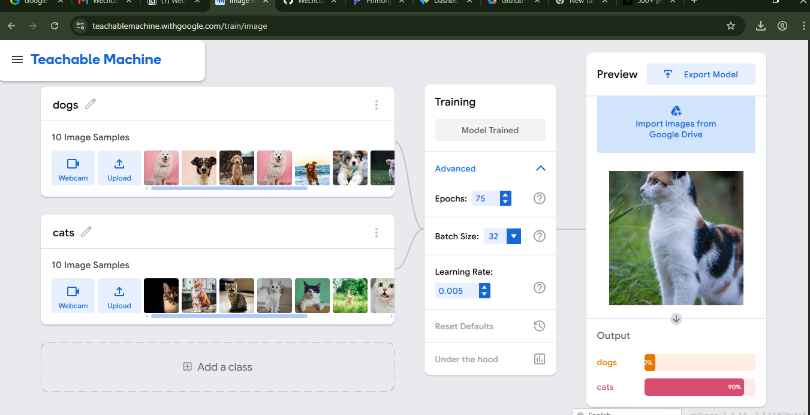
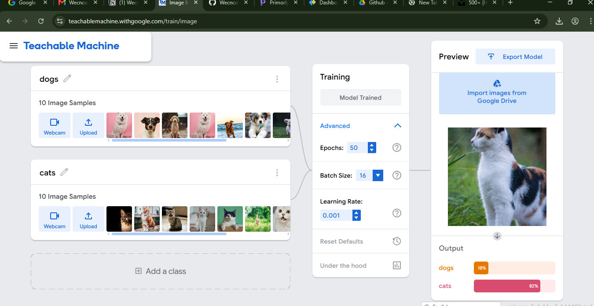
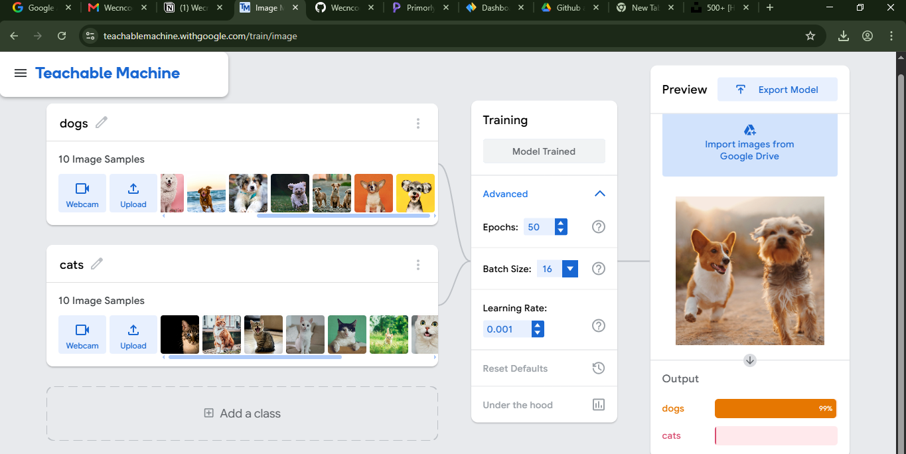
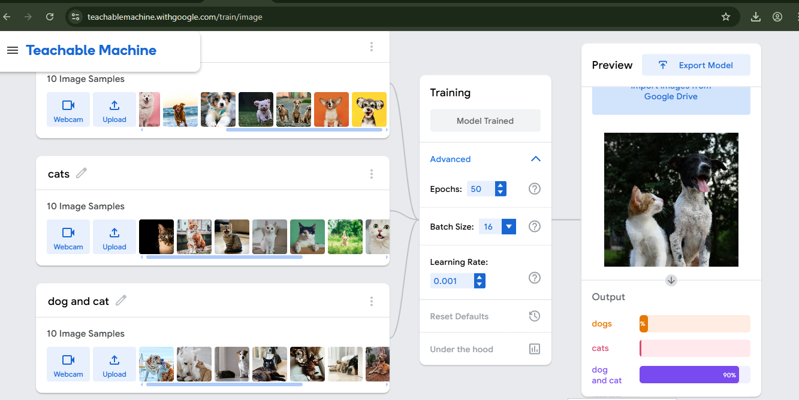
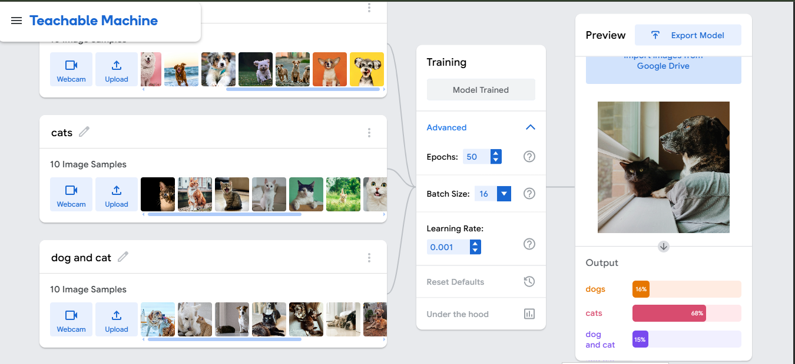
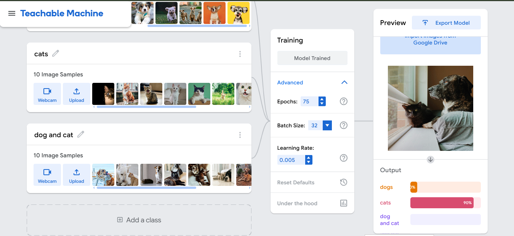

# Training a Teachable Machine

Training a model using Teachable Machine relies on **Transfer Learning**, a technique where a pre-trained model is fine-tuned to recognize new classes based on your specific input data.

## 1. Data Collection & Diversity
Before training begins, you must gather high-quality samples. Ensuring data diversity is critical to preventing bias and ensuring the model generalizes well in real-world conditions.
* **Background Variation:** Capture samples in different environments to prevent the model from associating the subject with a specific location.
* **Lighting Variation:** Use different lighting conditions (dim, bright, artificial, natural) to ensure robustness.
* **Class Balance:** Ensure that each class has roughly the same number of samples. An imbalanced dataset can cause the model to favor the majority class.
* **Avoiding Poisoned Data:** Be vigilant about "hidden triggers" (e.g., specific colors or background objects that might accidentally influence the model's decision-making process) to avoid poisoning your dataset.

## 2. Hyperparameter Tuning
Hyperparameters define the learning process. Adjusting these values refines the "brain" of the AI.

### Key Hyperparameters
| Hyperparameter | Definition | Impact |
| :--- | :--- | :--- |
| **Epochs** | The number of times the model iterates through the entire dataset. | **Too high:** Risk of *Overfitting* (memorizing data). **Too low:** Risk of *Underfitting* (failing to learn patterns). |
| **Batch Size** | The number of samples processed before the model updates its internal weights. | Affects memory usage and the stability of the training process. |
| **Learning Rate** | The magnitude by which the AI adjusts its internal logic after making an error. | A well-tuned rate ensures **smooth convergence** toward accuracy without "overshooting" the optimal solution. |

---
*Note: Effective machine learning is an iterative process. If your model performs poorly, revisit your data diversity and experiment with these hyperparameter adjustments to find the optimal balance for your specific project.*

#### Training Model outcomes
raising the hyperparameters to 75 epochs and 32 batch size with a learning rate of 0.005 results into overfitting hence causing 10% error

After setting the training parameters to 50 epochs, 16 batch size, and a 0.001 learning rate, the model is showing decent accuracy. The preview window currently demonstrates that the model successfully distinguishes a cat from a dog, assigning it an 82% probability for the cat category. this gives optimal fit.

making a dod the test specimen gives

adding a third class of dog and cat, the model recognises the presence of both a dog and a cat.

although the model recognised the presence of cat and dogs, introducing the the third class led to some sought of ambiguity where there is ovelapping similarities between the datasets in the first two classes and the third class.

the fact that the first two classes were recognised and the last class was not recognised and with the highest epochs of 75, then this is an overfitting.
