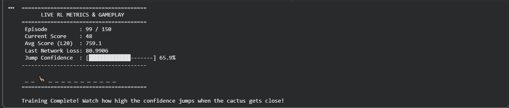
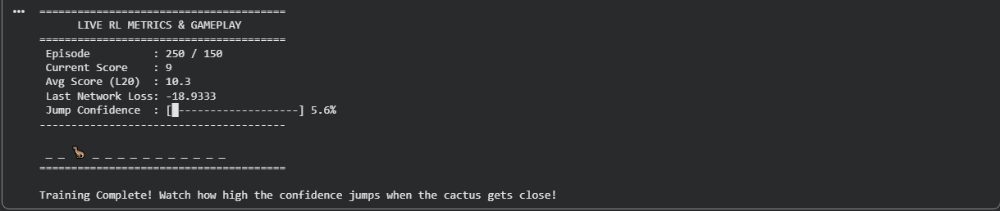
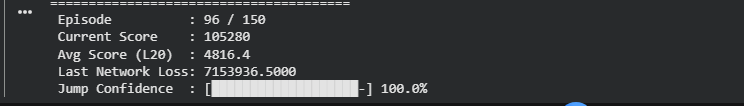

# REINFORCEMENT LEARNING
## Concept of Reinforcement learning
Reinforcement Learning is a branch of ML where an agent learns to make decisions by trial and error, taking actions in an environment to maximize cumulative rewards. 
Agent- decision maker taking actions eg the dino
Environment- sorrounding where the agent interacts and observations are made.
State- What the agent observes eg the cactus.
Actions- the jumping and the running.
Rewards- Can be the cumulative points.
## Observation from the Dino training
With a 0.01 learning rate, 99 epochs and 0.00 sleep time the a jump accuracy of 65.9% was obtained. 
High Learning Rate Effect: The high learning rate acted as an aggressive kick. It forced the agent to try jumping early on, which quickly overrode the fear of crashing and allowed the Dino to learn that jumping gives a $+5.0$ reward.  
Epoch Count Effect: 99 epochs gave it enough iterations to figure out the game mechanics and survive long runs (scoring over 700).  
Jump Confidence Outcome (65.9%): Because the learning rate was so high, the updates were too noisy for the model to settle. Instead of locking into a steady 90%+ confidence, the confidence swung around 65.9%.

For the second training using a 0.001 learning rate, 250 epochs and and 0.01 sleep time the jump accuracy dropped to 5.6%.
Low Learning Rate Effect: The lower learning rate made the agent overly cautious. After a few early failed jumps.
High Epoch Count Effect: Running for 250 epochs did not help because it simply locked this bad strategy in place. The Dino stopped trying to jump, so it never experienced successful jumps again.  
Jump Confidence Outcome (5.6%): The confidence collapsed to near 0% because the agent permanently learned to stay on the ground to avoid dying.

Keeping optimal conditions for hyperparameters gave me the following results:
